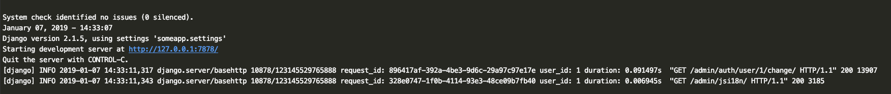

## django-context

#### `django-context` is an BSD licensed library written in Python. It could be helpful for you if you wanna set some custom context in your django app. The one of the examples is add an extra info into your logging records. Also, you can use a request object in any place of an application cause this library provides a capability to reach it out at any time during a request.

### Quick start

1 install the library:
```bash
pip install django-context
```

2 Add `django-context` to your INSTALLED_APPS setting like this:
```Python
    INSTALLED_APPS = [
        ...
        django_context,
    ]
```

3 Add proxy middleware to your MIDDLEWARE setting like this:
```Python
MIDDLEWARE = [
    'django_context.middleware.ProxyMiddleware',
    ...
]
```
It's important to place this `ProxyMiddleware` at the first place in a `MIDDLEWARE` to allow to calculate duration of response more precisely.

4 If you just want to add info about request duration and request id to your log records then you can use `GlobalWSGIMiddleware` in your `wsgi.py` like this:
```Python
application = GlobalWSGIMiddleware(get_wsgi_application())
```

5 Use this example of logging setting to set up your loggers correctly

```Python
LOGGING = {
    'version': 1,
    'formatters': {
        'verbose': {
            'format': ('[django] %(levelname)s %(asctime)s'
                       ' %(name)s/%(module)s'
                       ' %(process)d/%(thread)d'
                       ' request_id: %(request_id)s'
                       ' user_id: %(user_id)s'
                       ' duration: %(response_duration)s'
                       '  %(message)s')
        },
    },
    'filters': {
        'context_filter': {
            '()': 'django_context.logging.ContextFilter'
        }
    },
    'handlers': {
        'console': {
            'level': 'INFO',
            'class': 'logging.StreamHandler',
            'formatter': 'verbose',
            'filters': ['context_filter']
        }
    },
    'loggers': {
        'django_context': {
            'level': 'INFO',
            'handlers': ['console'],
            'propagate': True,
        },
        'django': {
            'level': 'INFO',
            'handlers': ['console'],
            'propagate': True,
        },
    }
}
```

### Log records example

